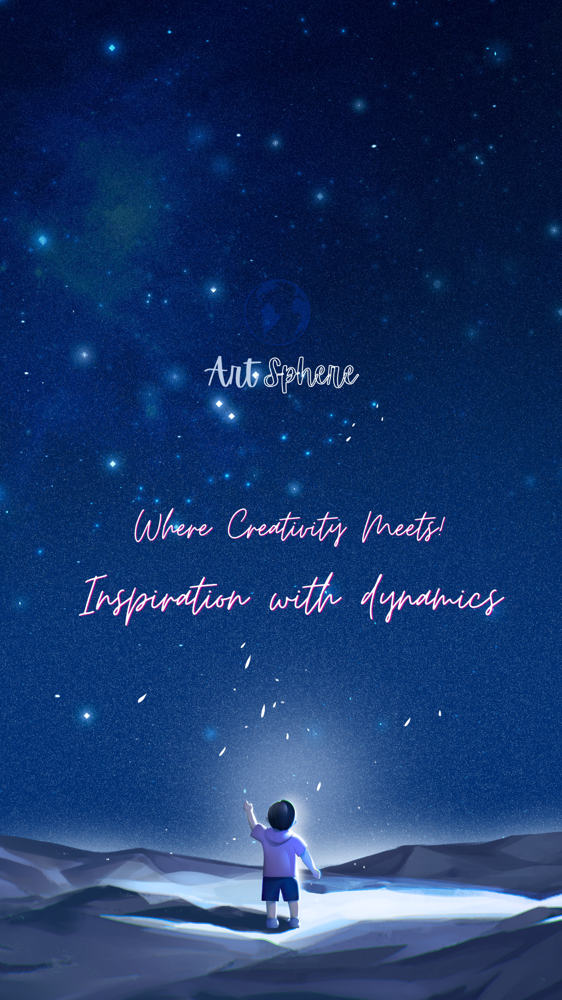

# ArtSphere - Wallpaper App

<div align="center">
  
  <h3>Beautiful Wallpapers at Your Fingertips</h3>
</div>

## 📱 Overview

ArtSphere is a modern Android wallpaper application that provides users with a vast collection of high-quality wallpapers. Built with the latest Android development technologies, it offers a seamless user experience with authentication, image browsing, and easy wallpaper setting capabilities.

## ✨ Features

### 🔐 **User Authentication**
- **Firebase Authentication** for secure user management
- User registration and login functionality
- Password reset capabilities
- Automatic login state management

### 🖼️ **Wallpaper Browsing**
- **Grid Layout**: Beautiful 2-column grid display of wallpapers
- **Infinite Scrolling**: Load more wallpapers as you scroll
- **High-Quality Images**: 1080x2244 resolution optimized for modern phones
- **Smooth Loading**: Shimmer effect during image loading
- **Image Source**: Powered by Picsum Photos API

### 🎨 **Wallpaper Preview & Setting**
- **Full-Screen Preview**: Immersive wallpaper viewing experience
- **Horizontal Swiping**: Navigate between nearby wallpapers
- **Smooth Animations**: Beautiful transitions and scaling effects
- **One-Click Setting**: Set wallpapers directly from the app
- **Multiple Options**: Choose between home screen, lock screen, or both

### 🎭 **Modern UI/UX**
- **Material Design 3**: Latest Material Design components
- **Jetpack Compose**: Modern declarative UI framework
- **Lottie Animations**: Beautiful animated backgrounds
- **Dark/Light Theme**: Automatic theme switching
- **Edge-to-Edge Design**: Immersive full-screen experience

### 🏗️ **Technical Excellence**
- **MVVM Architecture**: Clean separation of concerns
- **Dependency Injection**: Hilt for efficient dependency management
- **Coroutines**: Asynchronous programming for smooth performance
- **Repository Pattern**: Clean data layer architecture
- **State Management**: Reactive UI with StateFlow

## 📸 Screenshots
<div align="center">
  <table>
    <tr>
      <td align="center">
        <strong>Splash Screen</strong><br>
        
      </td>
      <td align="center">
        <strong>Login Screen</strong><br>
        
      </td>
      <td align="center">
        <strong>Register Screen</strong><br>
        
      </td>
    </tr>
    <tr>
      <td align="center">
        <strong>Home Screen</strong><br>
        
      </td>
      <td align="center">
        <strong>Previewer (Compose)</strong><br>
        
      </td>
      <td align="center">
        <strong>Set Wallpaper Pop-Up</strong><br>
        
      </td>
    </tr>
    <tr>
      <td align="center">
        <strong>User Posts</strong><br>
        
      </td>
      <td></td>
      <td></td>
    </tr>
  </table>
</div>


## 🛠️ Technology Stack

### **Frontend**
- **Kotlin**: Primary programming language
- **Jetpack Compose**: Modern UI toolkit
- **Material Design 3**: Latest design system
- **ViewBinding**: Type-safe view binding

### **Backend & APIs**
- **Firebase Authentication**: User authentication
- **Picsum Photos API**: Wallpaper image source
- **Retrofit**: HTTP client for API calls
- **Coil**: Image loading library

### **Architecture & Patterns**
- **MVVM**: Model-View-ViewModel architecture
- **Repository Pattern**: Data layer abstraction
- **Dependency Injection**: Hilt for DI
- **StateFlow**: Reactive state management

### **Libraries & Tools**
- **Hilt**: Dependency injection
- **Coroutines**: Asynchronous programming
- **Lottie**: Animation library
- **Shimmer**: Loading effects
- **Glide**: Image loading (legacy)
- **Accompanist**: Compose utilities

## 📋 Prerequisites

Before running this project, make sure yo!  
u have:

- **Android Studio** (latest version recommended)
- **JDK 17** or higher
- **Android SDK** (API level 27+)
- **Google Firebase** account for authentication
- **Internet connection** for API calls

## 🚀 Installation

### 1. Clone the Repository
```bash
git clone https://github.com/yourusername/Wallpaper-App-Reviewed.git
cd Wallpaper-App-Reviewed
```

### 2. Firebase Setup
1. Go to [Firebase Console](https://console.firebase.google.com/)
2. Create a new project or select existing one
3. Enable Authentication with Email/Password
4. Download `google-services.json` and place it in the `app/` directory

### 3. Build and Run
```bash
# Open in Android Studio
# Or use command line:
./gradlew build
./gradlew installDebug
```

## 📱 Usage

### **Getting Started**
1. **Launch the app** - Beautiful splash screen with animations
2. **Sign up/Login** - Create account or login with existing credentials
3. **Browse Wallpapers** - Scroll through the grid of beautiful wallpapers
4. **Preview & Set** - Tap any wallpaper to preview and set as background

### **Navigation**
- **Home Tab**: Browse all wallpapers
- **Arts Tab**: Access art-specific wallpapers
- **Profile Tab**: User profile and settings

### **Setting Wallpapers**
1. Tap any wallpaper in the grid
2. Swipe horizontally to view nearby wallpapers
3. Tap "Set Wallpaper" button
4. Choose where to apply (Home, Lock, or Both)
5. Confirm and enjoy your new wallpaper!

## 🔧 Configuration

### **API Configuration**
The app uses Picsum Photos API for wallpapers. Configuration is in:
```kotlin
// Constants.kt
const val BASE_URL = "https://picsum.photos"
const val END_POINT = "/v2/list/"
```

### **Image Quality Settings**
```kotlin
// Default image dimensions
width: Int = 1080  // Common width for modern Android phones
height: Int = 2244 // Common height for modern Android phones
```

### **Pagination Settings**
```kotlin
private var currentPage = 5
private val limit = 300  // Images per page
```

## 🏗️ Project Structure

```
app/src/main/java/com/example/wallpaper_dead_reviewed/
├── api/
│   ├── data/                    # Data layer
│   │   ├── PicSumApi.kt        # API interface
│   │   └── WallpaperRepositoryImpl.kt
│   ├── di/                      # Dependency injection
│   │   ├── AppModule.kt
│   │   └── GlideModule.kt
│   ├── domain/                  # Domain layer
│   │   ├── entity/
│   │   └── repository/
│   ├── model/                   # Data models
│   ├── presentation/            # UI layer
│   │   ├── adapter/
│   │   ├── composables/
│   │   ├── fragments/
│   │   ├── settingWallpaper/
│   │   ├── view/
│   │   └── viewmodel/
│   ├── Utils/                   # Utilities
│   └── WallpaperApp.kt         # Application class
```

## 🧪 Testing

The project includes comprehensive testing:

### **Unit Tests**
```bash
./gradlew test
```

### **Instrumented Tests**
```bash
./gradlew connectedAndroidTest
```

### **Test Coverage**
- Network calls testing
- UI state management
- Repository pattern testing

## 📊 Performance

### **Optimizations**
- **Lazy Loading**: Images load as needed
- **Caching**: Efficient image caching with Coil
- **Pagination**: Load wallpapers in batches
- **Memory Management**: Proper bitmap handling

### **Memory Usage**
- Optimized image loading
- Efficient bitmap management
- Proper lifecycle handling

## 🔒 Permissions

The app requires the following permissions:
- `INTERNET` - For API calls and image loading
- `SET_WALLPAPER` - To set wallpapers
- `ACCESS_NETWORK_STATE` - Network connectivity checks
- `READ_EXTERNAL_STORAGE` - For image access

## 🤝 Contributing

We welcome contributions! Please follow these steps:

1. Fork the repository
2. Create a feature branch (`git checkout -b feature/AmazingFeature`)
3. Commit your changes (`git commit -m 'Add some AmazingFeature'`)
4. Push to the branch (`git push origin feature/AmazingFeature`)
5. Open a Pull Request

### **Development Guidelines**
- Follow Kotlin coding conventions
- Use meaningful commit messages
- Add tests for new features
- Update documentation as needed

## 📄 License

This project is licensed under the MIT License - see the [LICENSE](LICENSE) file for details.

## 🙏 Acknowledgments

- **Picsum Photos** for providing beautiful wallpapers
- **Google Firebase** for authentication services
- **Jetpack Compose** team for the amazing UI toolkit
- **Material Design** team for the design system

## 🔄 Version History

- **v1.0.0** - Initial release with core features
  - User authentication
  - Wallpaper browsing
  - Wallpaper setting functionality
  - Modern UI with Compose

---

<div align="center">
  <p>Made with ❤️ using modern Android development practices</p>
  <p>⭐ Star this repository if you find it helpful!</p>
</div> 
